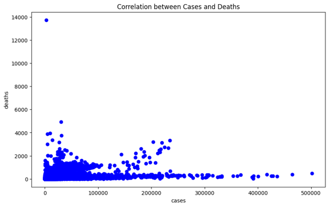
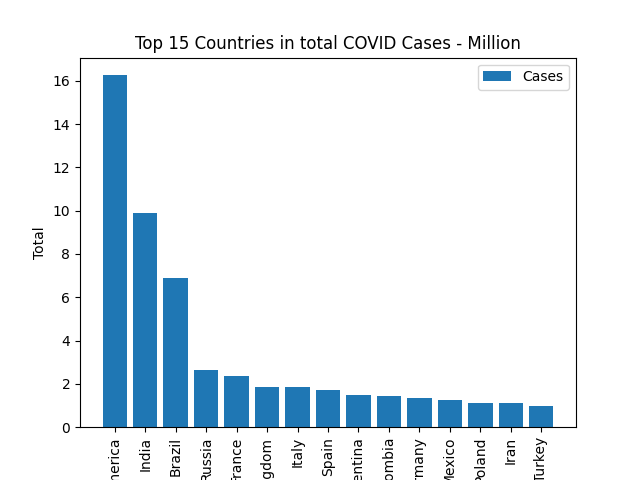
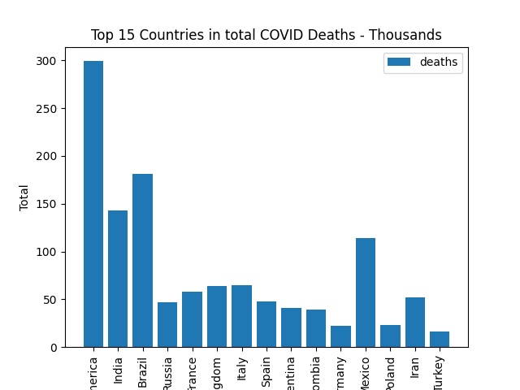

# COVID-19 Dashboard

This project is an end-to-end COVID-19 analytics dashboard covering global cases, deaths, and vaccinations from 2020 to 2022. It takes raw pandemic data through cleaning, processing, and visualization to produce an interactive dashboard that lets users explore how the pandemic evolved worldwide over this three-year period. The dashboard consolidates key metrics into a single view, making it easy to track trends, compare regions, and understand the relationship between case spread, mortality, and vaccine rollout.

## Tools & Libraries


## License 


## Data Sources

**Kaggle COVID-19 Stream Dataset**
  * Source: [https://www.kaggle.com/datasets/hgultekin/covid19-stream-data](https://www.kaggle.com/datasets/hgultekin/covid19-stream-data)
  * License: Open Database License (ODbL) [https://opendatacommons.org/licenses/odbl/](https://opendatacommons.org/licenses/odbl/)
  * Used files: `json`, `json_1`

**Our World in Data – COVID-19 Vaccinations**
  * Source: [https://archive.ourworldindata.org/20260616-064428/covid-vaccinations.html](https://archive.ourworldindata.org/20260616-064428/covid-vaccinations.html)
  * Authors: Edouard Mathieu, Hannah Ritchie, Lucas Rodés-Guirao, Cameron Appel, Daniel Gavrilov, Charlie Giattino, Joe Hasell, Bobbie Macdonald, Saloni Dattani, Diana Beltekian, Esteban Ortiz-Ospina, Max Roser
  * License: Creative Commons Attribution 4.0 International (CC BY 4.0) [https://creativecommons.org/licenses/by/4.0/](https://creativecommons.org/licenses/by/4.0/)
  * Used metric: `cumulative` vaccination data

## Dataset

**COVID-19 Stream Dataset** — 90,188 records covering daily COVID-19 case and death counts by country, with the following features:
- `day`, `month`, `year` — date components for each record
- `cases`, `deaths` — daily reported case and death counts
- `countriesAndTerritories`, `geoId`, `countryterritoryCode` — country/territory identifiers
- `popData2019`, `popData2020` — population figures used for normalization
- `continentExp` — continent classification
- `Cumulative_number_for_14_days_of_COVID-19_cases_per_100000` — 14-day cumulative case rate per 100,000 population

**COVID-19 Vaccinations Dataset** — 707 records tracking vaccination progress by country, with the following features:
- `Entity` — country or territory name
- `Code` — country code
- `People fully vaccinated (cumulative)` — cumulative count of fully vaccinated individuals

## Project Steps

1. **Loading and Cleaning Data** — Import both datasets, handle missing values, correct data types, and align country identifiers for consistent merging.
2. **Exploratory Data Analysis (EDA)** — Examine trends and distributions in cases, deaths, and vaccinations to identify patterns, outliers, and relationships in the data.
3. **Interactive Charts** — Build individual interactive visualizations using Plotly to represent cases, deaths, and vaccination progress.
4. **Dashboard** — Assemble the individual charts into a unified, interactive dashboard that allows users to explore the data.

## Key Visualizations from Exploratory Data Analysis:

### Correlation Between Cases and Deaths




### Top 15 Countries by Total COVID-19 Cases




### Top 15 Countries by Total COVID-19 Deaths



## File Structure

```
COVID-19-Dashboard/
│
├── index.html 
│
├── data/
│ ├── json/
│ ├── json_1/
│ └── number-of-people-who-completed-the-initial-covid-19-vaccination-protocol.csv
│
├── charts/
│ ├── Correlation
│ ├── Top_15_Cases
│ └── Top_15_Deaths
│
├── src/
│ ├── data_loader.py 
│ ├── EDA.py 
│ ├── plotly_fig.py 
│ └── dashboard.py 
│
└── README.md # Project documentation   
```

---

## Requirements

```
matplotlib==3.10.6
pandas==2.3.2
plotly==6.3.0
seaborn==0.13.2
```


If you find any issues or have suggestions, please open an issue — I’d love to hear from you.
